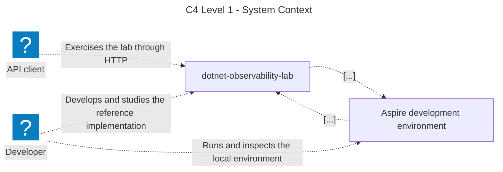
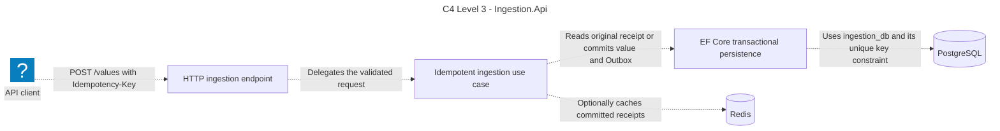
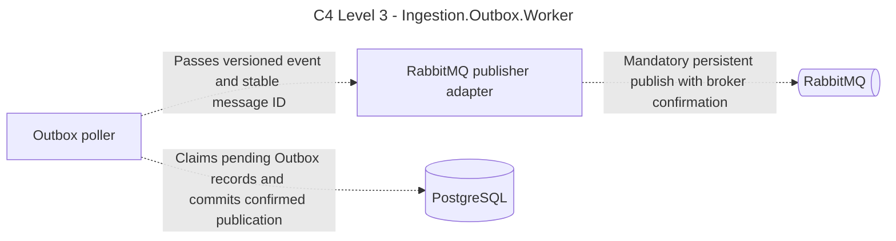
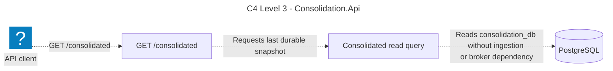
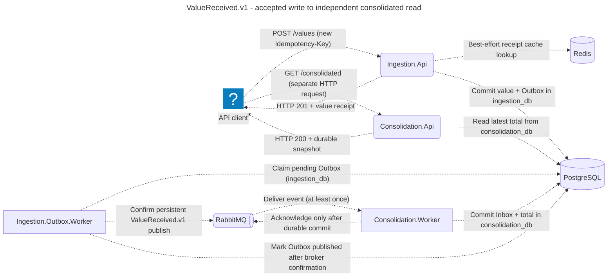
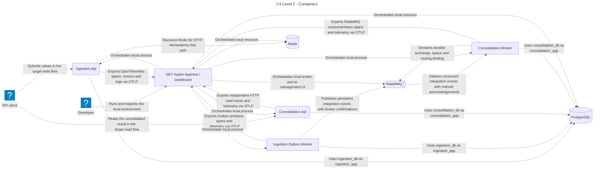

<!-- Generated by scripts/generate-architecture-markdown.sh from docs/architecture/{model,views}.c4. Do not edit manually. -->

<!-- Generated by likec4 export markdown. Do not edit manually. -->

# default

### C4 Level 1 - System Context

Shows who interacts with dotnet-observability-lab and keeps .NET Aspire explicit as development tooling rather than part of the functional message path.

### C4 Level 3 - Ingestion.Api

Shows the HTTP write boundary, idempotency, Redis optimization and the atomic PostgreSQL Outbox write.

### C4 Level 3 - Ingestion.Outbox.Worker

Dedicated PostgreSQL Outbox claiming and confirmed RabbitMQ publication, independent of Ingestion.Api.

### C4 Level 3 - Consolidation.Api

Independent HTTP read endpoint and read-only PostgreSQL query; no Ingestion.Api or RabbitMQ dependency.

### C4 Level 3 - Consolidation.Worker

Manual RabbitMQ acknowledgements after atomic PostgreSQL Inbox and read-model commit; no Redis consumer lookup.

```mermaid
---
title: "C4 Level 3 - Consolidation.Worker"
---
graph LR
  LabRabbitmq@{ shape: horizontal-cylinder, label: "RabbitMQ" }
  LabConsolidationWorkerRabbitConsumer@{ shape: rectangle, label: "RabbitMQ consumer adapter" }
  LabConsolidationWorkerInboxProcessor@{ shape: rectangle, label: "Transactional Inbox processor" }
  LabConsolidationWorkerConsolidationStore@{ shape: rectangle, label: "Consolidation persistence" }
  LabPostgresql@{ shape: cylinder, label: "PostgreSQL" }
  LabRabbitmq -. "`Delivers ValueReceived.v1`" .-> LabConsolidationWorkerRabbitConsumer
  LabConsolidationWorkerRabbitConsumer -. "`Passes validated neutral event`" .-> LabConsolidationWorkerInboxProcessor
  LabConsolidationWorkerInboxProcessor -. "`Claims Inbox and updates aggregate`" .-> LabConsolidationWorkerConsolidationStore
  LabConsolidationWorkerConsolidationStore -. "`Commits Inbox and total to 
consolidation_db`" .-> LabPostgresql
```

### ValueReceived.v1 - accepted write to independent consolidated read

One successful request, durable Outbox handoff and separate read request. Aspire receives OTLP telemetry only; it is not a business hop.

### C4 Level 2 - Containers

Shows independent APIs and active PostgreSQL, ingestion Redis and RabbitMQ business relationships; provisioned-only Redis references are not runtime edges. Separate OTLP exports end at the Aspire Dashboard, which does not route business traffic.

